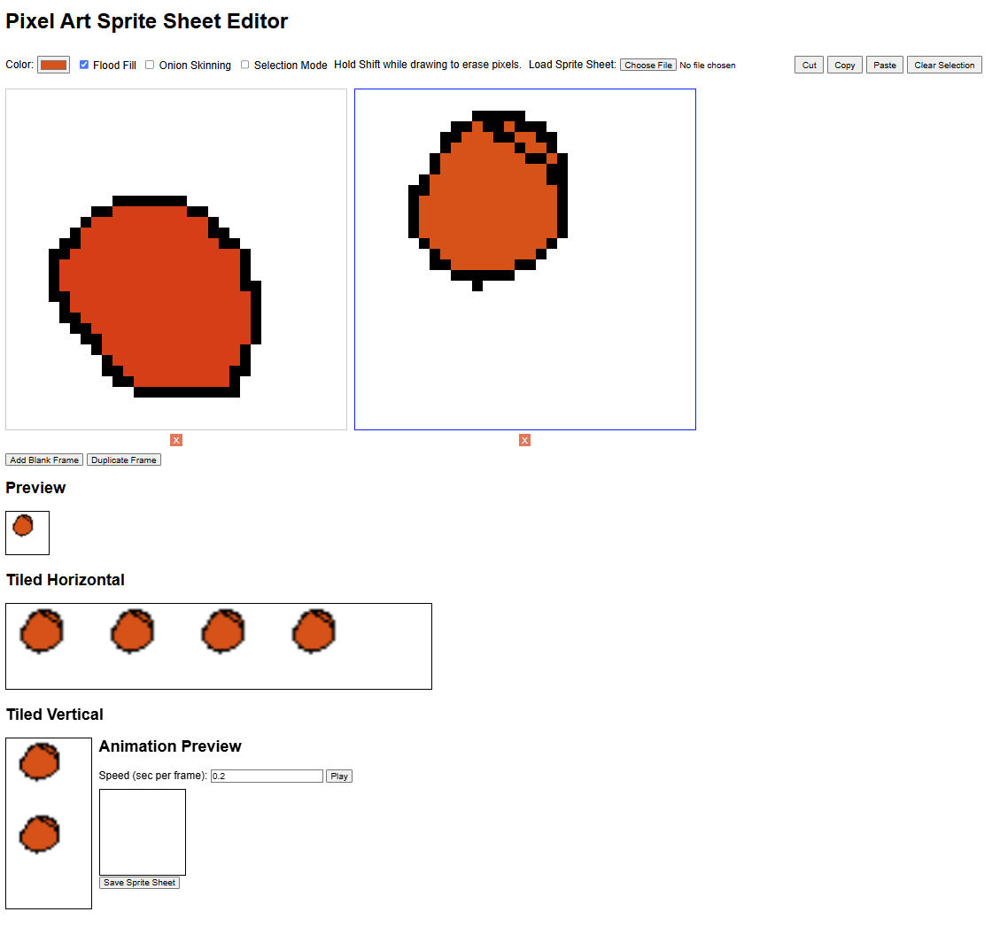

# HTML Pixel Art & Sprite Sheet Maker

This is a simple, zero-dependency pixel art editor that runs entirely in your web browser. Just download the HTML file and open it.

Or run in your browser now with a github page: https://dandeliondandy.github.io/PixelArtMaker/

It's designed for creating and animating small sprites, and for exporting them as a single sprite sheet `PNG` file.

## How to Use

1.  Download the `.html` file from this repository.
2.  Open the file in your favorite web browser (like Chrome, Firefox, or Edge).
3.  That's it! You're ready to start drawing.

## Features

#### Drawing & Editing
*   **Pixel Pen:** Click to draw with the selected color.
*   **Eraser:** Hold `Shift` while clicking to erase pixels.
*   **Flood Fill:** Check the "Flood Fill" box to fill areas with a single color.
*   **Eyedropper:** Hold `Ctrl` and click on the canvas to pick a color directly from your drawing.
*   **Undo/Redo:** Use `Ctrl+Z` to undo and `Ctrl+Y` to redo your last actions.

#### Selection Tools
*   **Selection Mode:** Check the "Selection Mode" box to enable selection tools.
*   **Select Area:** Click and drag to select a rectangular area of your sprite.
*   **Cut, Copy, Paste:** Use the buttons or standard keyboard shortcuts to manage your selection.
*   **Move Selection:** After selecting an area, you can click and drag it to a new position.

#### Animation
*   **Frames:** Add, duplicate, or delete frames to create an animation sequence.
*   **Live Animation Preview:** See your animation play in real-time and adjust the speed.
*   **Onion Skinning:** Check the "Onion Skinning" box to see a faint overlay of the previous frame, making animation easier.

#### File Management
*   **Save Sprite Sheet:** Exports all your frames into a single, horizontal `sprite_sheet.png` file, ready for use in games or other projects.
*   **Load Sprite Sheet:** Load a previously saved sprite sheet. The tool will automatically slice the image back into individual frames.

#### Previews
*   **Zoomed Preview:** A larger preview of your active frame.
*   **Tiled Previews:** See how your sprite looks when tiled horizontally and vertically, which is useful for creating patterns or testing game backgrounds.

## Keyboard Shortcuts

*   `Shift` + `Click`: Erase
*   `Ctrl` + `Click`: Eyedropper (pick color)
*   `Ctrl` + `Z`: Undo
*   `Ctrl` + `Y`: Redo
*   `Ctrl` + `X`: Cut (when in selection mode)
*   `Ctrl` + `C`: Copy (when in selection mode)
*   `Ctrl` + `V`: Paste (when in selection mode)
